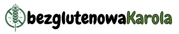
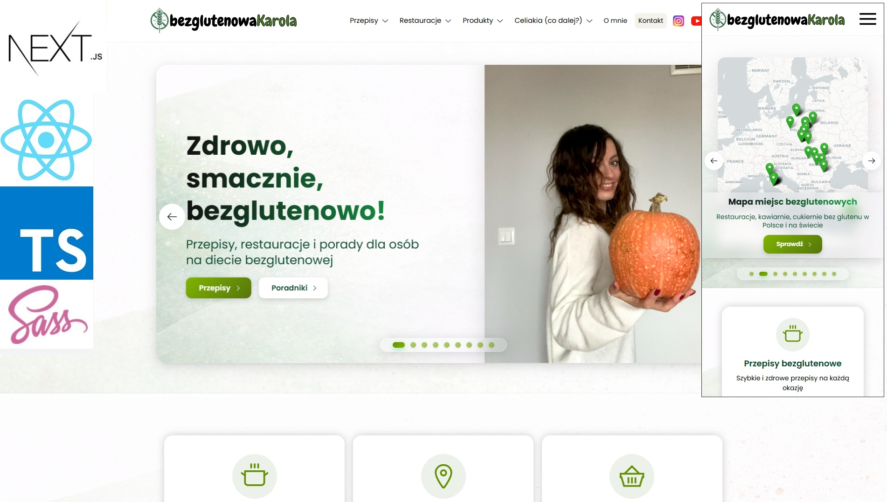

<h1 align="center">Bezglutenowa Karola</h1>
<i align="center">
<p>A gluten-free, sugar-free and dairy-free recipe platform</p>
</i>

<p align="center">
    
</p>

<p align="center">
    This is a <a href="https://nextjs.org/">Next.js, TypeScript</a> project bootstrapped with <a href="https://github.com/vercel/next.js/tree/canary/packages/create-next-app">create-next-app</a>.
</p>

## Overview

This repository powers [bezglutenowakarola.pl](https://bezglutenowakarola.pl/), a website created by Marcin Godlewski. The site is dedicated to sharing delicious and wholesome recipes for those living with coeliac disease or following a gluten-free, sugar-free, and dairy-free diet.  
The platform is built with modern web technologies and designed to be both inspiring and accessible for people navigating dietary restrictions.

## Table of Contents

- [Features](#features)
- [Technologies](#technologies)
- [Getting Started](#getting-started)
- [Deployment](#deployment)
- [Project Structure](#project-structure)
- [Contributing](#contributing)
- [License](#license)
- [About](#about)

## Features

- A blog-style site presenting recipes that are **gluten-free**, **sugar-free**, and **dairy-free**.
- Built with a strong foundation for maintainability: TypeScript, SCSS, React + Next.js.
- Responsive design so users on mobile and desktop have a seamless experience.
- Designed for accessibility and clarity to support individuals with dietary restrictions.
- Easy to extend with new recipes, categories, and content.

## Technologies

- [Next.js](https://nextjs.org/) – React framework for server-rendered and statically generated web apps.
- React.js – UI library.
- TypeScript – static typing for safer, more maintainable code.
- SASS/SCSS – for modular and reusable styles.

## Getting Started

### Prerequisites

Make sure you have:

- Node.js (version 14+ or as per `package.json`)
- npm, Yarn or pnpm (whichever you prefer)
- (Optional) bun, if you use it for local dev

## Installation

1. Clone the repository:

```bash
git clone https://github.com/goldipl/foods-website.git
cd foods-website
```

2. Install dependencies:

```bash
npm install
# or
yarn
# or
pnpm install
# or (if using bun)
bun install
```

## Running Locally

Start the development server:

```bash
npm run dev
# or
yarn dev
# or
pnpm dev
# or
bun dev
```

Then open your browser at http://localhost:3000 to view the site.

## Building for Production

```bash
npm run build
npm run start
```

(or the equivalent commands for your package manager)

## Deployment

The site can be deployed to platforms that support Next.js (for example, Vercel
).
GitHub

Ensure environment variables (if any) and build settings match your hosting provider.

## Project Structure

```bash
.
├── public/                # Static assets (images, icons, etc.)
├── src/                   # Application source code (components, pages, styles)
├── screenshots/           # Visual references / preview images
├── package.json
├── tsconfig.json
├── next.config.mjs
├── README.md
└── LICENSE.md
```

## Screenshots



## License

This work is licensed under a Creative Commons Non-Commercial (CC BY-NC) License.
GitHub

(Note: “Non-Commercial” means you may not use this work for commercial purposes without prior permission.)

## About

This site is a labour of love by Karolina Wontorska, built to support individuals navigating gluten-free, sugar-free and dairy-free lifestyles.
If you have questions or want to collaborate, feel free to open an issue or get in touch via the repository.
