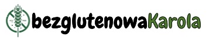

# Bezglutenowa Karola

<div align="center">
  
  <p><em>A gluten-free, sugar-free, and dairy-free recipe platform</em></p>
</div>

<div align="center">
  <a href="https://bezglutenowakarola.pl">🌐 Live Demo</a> •
  <a href="#features">Features</a> •
  <a href="#getting-started">Getting Started</a> •
  <a href="#contributing">Contributing</a>
</div>

---

## 📖 Overview

**Bezglutenowa Karola** is a dedicated website for sharing delicious, wholesome recipes tailored for individuals with coeliac disease or those following gluten-free, sugar-free, and dairy-free diets. Built by Karolina Wontorska and maintained by Marcin Godlewski, this platform empowers users to discover nutritious alternatives without compromising on taste.

The website is crafted with modern web technologies to ensure a seamless, accessible, and inspiring experience for everyone navigating dietary restrictions.

## ✨ Features

- **🍽️ Recipe Collections**: Curated recipes across categories like appetizers, breakfasts, desserts, and dinners – all gluten-free, sugar-free, and dairy-free.
- **🏪 Restaurant Guides**: Discover gluten-free friendly restaurants in Poland and Europe.
- **📅 Events & Workshops**: Stay updated on celiac disease awareness events and educational sessions.
- **🗺️ Interactive Map**: Locate nearby gluten-free resources and dining options.
- **📱 Responsive Design**: Optimized for mobile and desktop for an intuitive user experience.
- **♿ Accessibility Focused**: Designed with clarity and usability in mind for users with dietary needs.
- **🔍 Search & Filter**: Easily find recipes and products with built-in search functionality.
- **📄 Blog-Style Content**: Engaging articles and tips on living gluten-free.

## 🛠️ Technologies

This project leverages cutting-edge web technologies for performance and maintainability:

- **[Next.js](https://nextjs.org/)** – React framework for server-side rendering and static site generation.
- **React.js** – Component-based UI library.
- **TypeScript** – Type-safe JavaScript for robust development.
- **SCSS/SASS** – Modular and scalable styling.
- **Swiper** – For interactive carousels and sliders.
- **Node.js** – Runtime environment for development and building.

## 🚀 Getting Started

Follow these steps to set up the project locally.

### Prerequisites

Ensure you have the following installed:

- **Node.js** (version 18+ recommended, check package.json for exact version)
- **npm**, **Yarn**, **pnpm**, or **Bun** (any package manager of your choice)

### Installation

1. **Clone the repository**:
   ```bash
   git clone https://github.com/goldipl/foods-website.git
   cd foods-website
   ```

````

2. **Install dependencies**:
   ```bash
   npm install
   # or
   yarn install
   # or
   pnpm install
   # or
   bun install
````

### Usage

#### Running Locally

Start the development server:

```bash
npm run dev

# or

yarn dev

# or

pnpm dev

# or

bun dev
```

Open [http://localhost:3000](http://localhost:3000) in your browser to view the application.

#### Building for Production

1. Build the application:

   ```bash
   npm run build

   # or

   yarn build

   # or

   bun run build
   ```

2. Start the production server:
   ```bash
   npm run start
   # or
   yarn start
   # or
   pnpm start
   # or
   bun run start
   ```

## 🌐 Deployment

The application is optimized for deployment on platforms supporting Next.js, such as:

- **Vercel** (recommended for seamless integration)
- **Netlify**
- **AWS Amplify**
- **Self-hosted** on servers with Node.js support

Ensure to configure environment variables (if any) and build settings according to your hosting provider's documentation.

## 📁 Project Structure

```foods-website/
├── public/                 # Static assets (images, icons, fonts)
│   ├── icons/              # Icon assets
│   └── img/                # Image assets
├── src/                    # Source code
│   ├── app/                # Next.js app directory
│   │   ├── layout.tsx      # Root layout
│   │   └── page.tsx        # Home page
│   ├── components/         # Reusable React components
│   │   ├── common/         # Shared components (Header, Footer, etc.)
│   │   └── main-page/      # Page-specific components
│   ├── css/                # External CSS libraries
│   ├── data/               # Static data files (recipes, products, etc.)
│   ├── fonts/              # Custom fonts
│   ├── pages/              # Additional pages (if using pages router)
│   ├── sass/               # SCSS stylesheets
│   └── utils/              # Utility functions and constants
├── screenshots/            # Preview images
├── package.json            # Dependencies and scripts
├── tsconfig.json           # TypeScript configuration
├── next.config.mjs         # Next.js configuration
└── README.md               # This file
```

## 🤝 Contributing

We welcome contributions to make Bezglutenowa Karola even better! Here's how you can help:

1. **Fork the repository** and create a feature branch.
2. **Make your changes** – ensure code quality and add tests if applicable.
3. **Submit a pull request** with a clear description of your changes.

For major changes, please open an issue first to discuss your ideas.

### Guidelines

- Follow the existing code style and TypeScript conventions.
- Test your changes locally before submitting.
- Update documentation if needed.

## 📄 License

This project is licensed under the **Creative Commons Attribution-NonCommercial 4.0 International (CC BY-NC 4.0)** license.

[](https://creativecommons.org/licenses/by-nc/4.0/)

You may not use this work for commercial purposes without prior permission.

## 📞 Contact & About

**Bezglutenowa Karola** is a passion project by **Karolina Wontorska**, dedicated to supporting the gluten-free community. Maintained by **Marcin Godlewski**.

- **Website**: [bezglutenowakarola.pl](https://bezglutenowakarola.pl)
- **GitHub**: [goldipl/foods-website](https://github.com/goldipl/foods-website)

For questions, collaborations, or feedback, feel free to open an issue on GitHub or reach out directly.

---

<div align="center">
  <p>Made with ❤️ for the gluten-free community</p>
</div>
