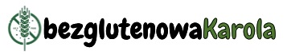

<div align="center">
  <h1>Bezglutenowa Karola</h1>
  
  <p><em>A recipe, advice, and recommendation website for people with celiac disease and gluten-free diets.</em></p>
</div>

<div align="center">
  <a href="https://bezglutenowakarola.pl">🌐 Live site</a> •
  <a href="#features">Features</a> •
  <a href="#local-setup">Local setup</a> •
  <a href="#project-structure">Project structure</a>
</div>

---

## About the project

This is a modern website dedicated to healthy, gluten-free, sugar-free, and dairy-free eating. Its main goal is to provide culinary inspiration, information about gluten-free diets, location recommendations, and practical tools for people with celiac disease and those following elimination diets.

The site is built with Next.js using React, TypeScript, and Sass. It includes both informational content and interactive features such as a recipe search, a gluten-free places map, a shopping planner, and educational sections.

## Features

### 1. Rich landing page

- hero section with main message and CTA,
- intro and infographic sections,
- article showcase,
- educational sections about celiac disease,
- recommendations for products, restaurants, hotels, and collaboration,
- events and contact section,
- video content and informational modal.

### 2. Recipe collections by category

- breakfasts,
- dinners,
- snacks,
- desserts,
- search by data and tags,
- individual pages for each recipe group.

### 3. Interactive map of gluten-free places

- map powered by Leaflet and react-leaflet,
- location markers,
- search by name, address, city, and country,
- tabular list of places,
- pagination,
- option to jump to the selected location on the map.

### 4. Shopping planner

- store selection,
- budget, number of people, and number of days,
- automatically generated shopping list,
- cost summary,
- mark items as purchased,
- recipe suggestions linked to the selected shopping list.

### 5. Informational and community sections

- educational articles and posts,
- information about celiac disease,
- recommendations for places in Poland and Europe,
- events and workshops,
- collaboration and contact section.

### 6. Responsive UI

- built for different screen sizes,
- reusable components,
- styling with SCSS,
- integration of sliders (Swiper) and icons (react-icons).

## Tech stack

- Next.js 16
- React 19 RC
- TypeScript
- Sass / SCSS
- Leaflet + react-leaflet
- Swiper
- react-icons
- sharp

## Local setup

### Requirements

- Node.js 18+ (recommended 18.18+ or newer)
- npm / yarn / pnpm / bun

### Installation

```bash
git clone https://github.com/goldipl/foods-website.git
cd foods-website
npm install
```

### Development mode

```bash
npm run dev
```

Once started, the app is available at:

```text
http://localhost:3000
```

### Production build

```bash
npm run build
```

### Production server

```bash
npm run start
```

### Additional scripts

```bash
npm run lint
npm run export
```

## Project structure

```text
foods-website/
├── public/                       # static assets: images, icons, graphics
│   ├── icons/
│   ├── img/
│   └── ...
├── screenshots/                  # project screenshots
├── src/
│   ├── app/                      # Next.js app configuration
│   ├── components/
│   │   ├── common/               # shared components (header, footer, modal, searchbar)
│   │   ├── main-page/            # landing page sections
│   │   ├── map/                 # map component and geolocation logic
│   │   ├── recipes/             # recipe lists and search
│   │   └── shopping/            # shopping planner
│   ├── css/                      # external CSS libraries
│   ├── data/                     # recipe, events, hotels, restaurant, and map data
│   ├── fonts/                    # custom fonts
│   ├── pages/                    # application pages (routing)
│   ├── sass/                     # SCSS project styles
│   └── utils/                    # constants and helpers
├── package.json                  # dependencies and scripts
├── tsconfig.json                 # TypeScript configuration
├── next.config.mjs               # Next.js configuration
├── README.md                     # project documentation
├── LICENSE.md                    # project license
└── .gitignore                    # files ignored by Git
```

## Main pages

- `/` — homepage with informational sections and promotions
- `/szukaj-przepisow` — recipe search and all-recipe list
- `/sniadania` — breakfast recipes
- `/obiady` — dinner recipes
- `/przekaski` — snack recipes
- `/desery` — gluten-free desserts
- `/restauracje-w-polsce` — restaurants in Poland
- `/restauracje-w-europie` — restaurants in Europe
- `/hotele` — hotel recommendations
- `/wydarzenia` — events calendar
- `/bezglutenowe-miejsca` — interactive map of locations
- `/koszyk-zakupowy` — shopping planner
- `/artykuly` — article list

## Deployment

The project is prepared for deployment on platforms supporting Next.js, primarily:

- Vercel
- Netlify
- other hosts supporting Node.js and Next.js

## Contributing

Contributions and improvements are welcome.

1. Fork the repository.
2. Create a feature branch.
3. Make your changes and check them locally.
4. Open a pull request with a description of the changes.

Note that the project currently does not include automated unit tests; the key verification step is local build and linting.

## License

This project is distributed under the following license:

Creative Commons Attribution-NonCommercial 4.0 International (CC BY-NC 4.0)

[](https://creativecommons.org/licenses/by-nc/4.0/)

## Contact

- Website: [bezglutenowakarola.pl](https://bezglutenowakarola.pl)
- GitHub: [goldipl/foods-website](https://github.com/goldipl/foods-website)
- Project author: Karolina Wontorska-Godlewska
- Technical support / maintenance: Marcin Godlewski

---

<div align="center">
  <p>Made with ❤️ for the gluten-free community.</p>
</div>
